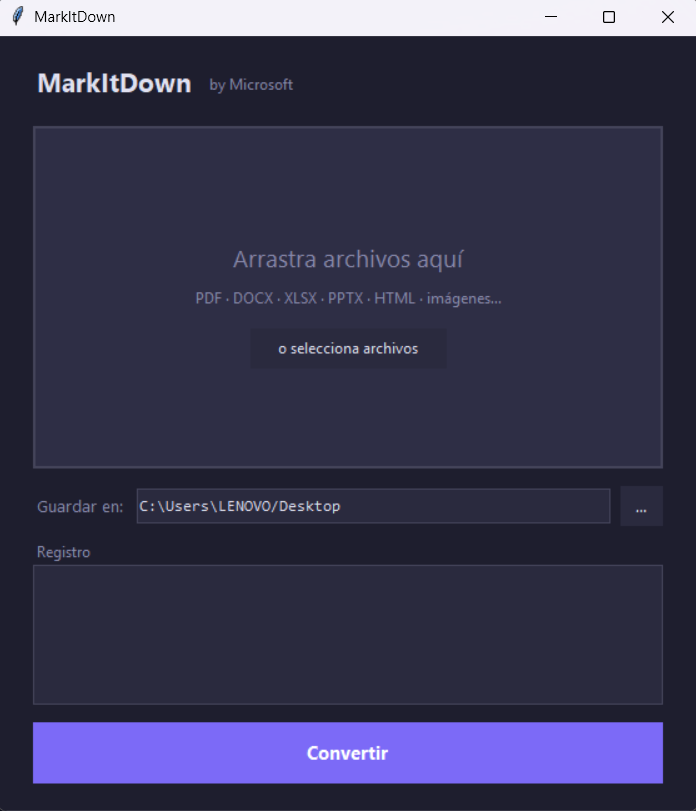

# MarkItDown GUI

A lightweight Windows desktop application that wraps [Microsoft's MarkItDown](https://github.com/microsoft/markitdown) library with a clean drag-and-drop interface — convert any supported file to Markdown in one click.



---

## Features

- **Drag & drop** files directly onto the window
- **Batch conversion** — queue multiple files at once
- **Custom output folder** — pick any destination directory
- **Conversion log** — real-time green/red feedback per file
- **No terminal needed** — runs as a silent desktop shortcut
- Supports all formats that MarkItDown handles

## Supported File Types

| Category | Formats |
|----------|---------|
| Documents | `.pdf`, `.docx`, `.xlsx`, `.xls`, `.pptx`, `.ppt` |
| Web | `.html`, `.htm` |
| Data | `.csv`, `.json`, `.xml` |
| Plain text | `.txt` |
| Images | `.jpg`, `.jpeg`, `.png`, `.gif`, `.bmp`, `.webp` |
| Audio | `.mp3`, `.wav` |
| Archives | `.zip` |

---

## Requirements

- Python 3.9+
- Windows 10 / 11

## Installation

```bash
# 1. Clone the repository
git clone https://github.com/Christopher-V36/markitdown-gui.git
cd markitdown-gui

# 2. Install dependencies
pip install -r requirements.txt
```

## Usage

### Run directly

```bash
python markitdown-gui.py
```

### Run without a terminal window (Windows)

```bash
pythonw markitdown-gui.py
```

### Desktop shortcut (recommended)

Create a shortcut pointing to:
```
Target:    C:\Path\To\Python\pythonw.exe "C:\Path\To\markitdown-gui\markitdown-gui.py"
Start in:  C:\Path\To\markitdown-gui
```

---

## How it works

1. **Drop files** onto the drop zone, or click **"o selecciona archivos"** to browse
2. **Choose a destination folder** with the `…` button (defaults to Desktop)
3. Click **Convertir** — the converted `.md` files appear in your chosen folder
4. The log panel shows a ✓ for each success and ✗ with the error message for failures

---

## Tech stack

| Library | Purpose |
|---------|---------|
| [markitdown](https://github.com/microsoft/markitdown) | File-to-Markdown conversion engine |
| [tkinterdnd2](https://github.com/pmgagne/tkinterdnd2) | Drag-and-drop support for Tkinter |
| tkinter | GUI framework (stdlib) |

---

## License

[MIT](LICENSE) © Christopher-V36
